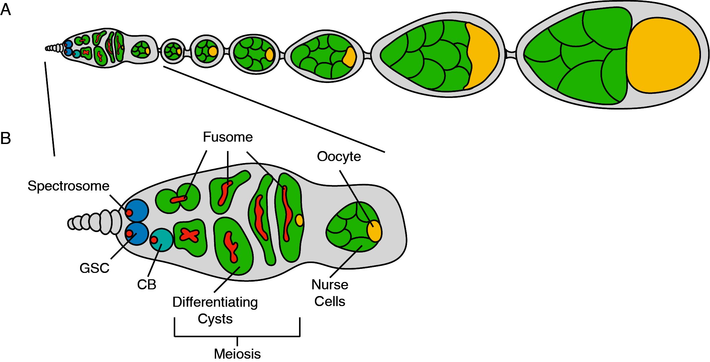
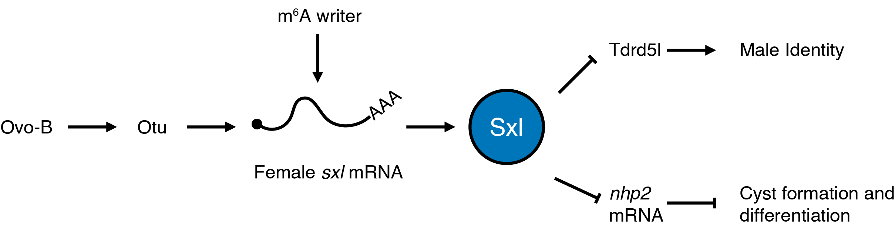
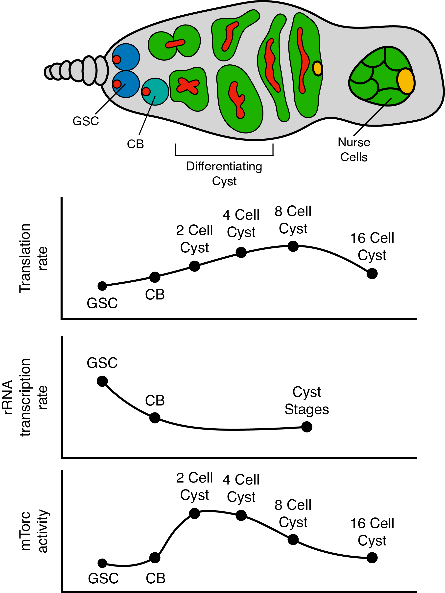

\setstretch{1.0}

(ref:book-F1) (A) **Schematic of *Drosophila* ovariole.** *Drosophila* females have two ovaries consisting of 16--20 ovarioles, which are assembly lines for producing mature eggs. The germarium, the structure that houses the germline stem cell (GSC), is present at anterior tip of the ovariole. The germline stem cell asymmetrically divides, giving rise to another GSC and a GSC daughter. The daughter cell then will undergo four incomplete rounds of mitosis, giving rise to a 16-cell cyst. Of the 16 cells one will be specified as the egg while the others serve as polyploid nurse cells that support oocyte and egg development. The surrounding somatic cells encapsulate the 16-cell cyst creating egg chambers. As development proceeds, the nurse cells provide mRNAs and proteins allowing the oocyte to grow in size and to eventually become a mature egg. (B) Inset of a germarium showing the developing germline, with the GSC located at the most anterior tip. Upon differentiation, the CB will undergo 4 incomplete mitotic divisions giving rise to a 16-cell cyst. Only one cell of the sixteen cells completes meiosis and is destined to become the oocyte.

(ref:book-F1-short) **Schematic of *Drosophila* ovariole.**

(ref:book-F2) **Schematic of the pathway that promotes alternative splicing of *sxl* to generate the female *sex determining* variant in the germline.** Ovo-B promotes the transcription of *otu,* which enhances splicing of *sxl*. The female-specific splice form of *sxl* is further enhanced by RNA modification by the m6A writer. Formation of the female-specific form generates a functional Sxl protein. Sxl represses Tdrd5l, a protein that promotes male identify. Additionally, Sxl post-transcriptionally represses *nhp2* to promote cyst formation during differentiation.

(ref:book-F2-short) **Schematic of the pathway that promotes alternative splicing of *sxl*.**

(ref:book-F3) **Global translation rate, rRNA transcription rate, and mTorc1 activity during development.** Schematic representing the germarium and plots representing relative changes in global translation rate, rRNA transcription rate, and mTorc1 activity during development at the developmental stages indicated. As germline stem cell differentiation occurs rRNA production decreases, while global translation initially increases as differentiation occurs then falls off post differentiation. A global regulator of both translation and rRNA production, mTorc1 activity decreases during differentiation and increases post differentiation.

(ref:book-F3-short) **Global translation rate, rRNA transcription rate, and mTorc1 activity during development.**

(ref:book-F4) **Schematic of combinatorial and dynamic translation regulation in the *Drosophila* germarium.** In the GSCs Nos, Pum and Twin form a complex to inhibit the translation of differentiation mRNAs such as *pgc*, which increases throughout oogenesis. Expression of Bam in the CB initiates differentiation by interacting with its partner Bgcn and Mei-P26 to repress the translation of GSC-expressed mRNAs, specifically *nos*. As Nos protein levels decrease in the CB, Pum is available to partner with Brat to repress the translation of self-renewal genes and *pgc*. In cyst stages, Rbfox1 binds the *pum* 3\' UTR to inhibit its translation. Throughout oogenesis Bru and Cup continuously block translation of *pgc*.

(ref:book-F4-short) **Schematic of combinatorial and dynamic translation regulation in the *Drosophila* germarium.**

# Post-transcriptional gene regulation instructs germline stem cell to oocyte transition during *Drosophila* oogenesis

Patrick Blatt, Elliot T. Martin, Shane M. Breznak, Prashanth Rangan\*

Department of Biological Sciences/RNA Institute, University at Albany
SUNY, Albany, NY
University at Albany SUNY, 1400 Washington Avenue, Albany, 12222, USA
\*Correspondence to: prangan\@albany.edu

\setstretch{2.0}

## Abstract

During oogenesis, several developmental processes must be traversed to
ensure effective completion of gametogenesis including, stem cell
maintenance and asymmetric division, differentiation, mitosis and
meiosis, and production of maternally contributed mRNAs, making the germ
line a salient model for understanding how cell fate transitions are
mediated. Due to silencing of the genome during meiotic divisions, there
is little instructive transcription, barring a few examples, to mediate
these critical transitions. In *Drosophila*, several layers of
post-transcriptional regulation ensure that the mRNAs required for these
processes are expressed in a timely manner and as needed during germline
differentiation. These layers of regulation include alternative
splicing, RNA modification, ribosome production, and translational
repression. Many of the molecules and pathways involved in these
regulatory activities are conserved from *Drosophila* to humans making
the *Drosophila* germline an elegant model for studying the role of
post-transcriptional regulation during stem cell differentiation and
meiosis.

**Key words**\
[Splicing, Translation Control, RNA Modifications, Ribosome Biogenesis,]{.underline}\
[Oogenesis, Drosophila, Germline Stem Cell, RNA regulation, Germline,]{.underline}\
[Differentiation, Gametogenesis, RNA Binding Proteins]{.underline}\

## Introduction

Gametogenesis gives rise to eggs or sperm in all sexually-reproducing
organisms [@Cinalli2008d;@Ellis1994d;@Lesch2012b;@Seydoux2006].
Thus, understanding how gametogenesis is regulated is critical to
comprehending this essential phenomenon that dictates fertility.
Post-fertilization, the zygote gives rise to an entire organism, thus
understanding how gametogenesis is regulated also has implications for
the field of regeneration [@Lasko2012a;@Lee2014c;@Magnusdottir2014d;@Soldner2018d;@Tadros2009c;@Theunissen2017b].
*Drosophila melanogaster* has been one of the central organisms used to
study heritability and gametogenesis for nearly a century due to its
rapid generation time and genetic tractability [@Mattox1990;@Spradling1981b;@Spradling1993b;@Spradling2011f;@Spradling1997e;@Xie2007a]. These traits have facilitated the establishment of an
extensive collection of informative and useful mutant and transgenic
flies [@Hales2015a]. In addition, many of the gametogenic regulatory
factors described in the *Drosophila* germ line are conserved to mammals
and also play critical roles in other tissues, such as neurons
[@Goldstrohm2018c;@Lin1997b;@Reichardt2018d;@Vessey2010b;@Zamore1999b;@Zhang2015c]. While both male and female *Drosophila*
undergo meiosis to give rise to gametes, here we focus on the female
germline as regulation of gametogenesis in males has been reviewed
elsewhere [@Barreau2008d;@Fuller1998c;@Spradling2011f;@Yamashita2005d;@Zhao2002d].

The spatiotemporal stages of *Drosophila* oogenesis are discrete and can
be easily identified by their morphology and molecular markers
[@Gaspar2017b;@Jia2016b;@Spradling2011f]. At the anterior end of
the ovary, germline stem cells (GSCs) reside in a structure known as the
germarium and initiate differentiation to give rise to gametes
[@Kai2005;@Twombly1996d;@Xie2000b;@Xie1998d;@Xie2007a]. GSCs
are maintained by signaling from the surrounding somatic niche. GSCs
undergo asymmetric mitotic division, producing a stem cell daughter, or
cystoblast (CB) which will begin the process of differentiation by
expressing the essential differentiation factor *bag of marbles* (*bam*)
[@Chen2003q;@McKearin1995b]. The differentiating CB then undergoes
four incomplete mitotic divisions, giving rise to an interconnected
16-cell cyst [@McKearin1995b;@McKearin1990e]. In this cyst, one
cell is designated to become the oocyte and the other 15 cells take on
the role of nurse cells, which generate proteins and mRNAs that are
provided to the developing oocyte [@Navarro2004b;@Spradling1997e].
The specified oocyte and its associated nurse cells are then
encapsulated by somatic cells to form an egg chamber that buds off from
the germarium (Figure 1B) [@Gilboa2004a;@Margolis1995a]. The nurse
cells will enter into a unique state in which they undergo a modified
version of the cell cycle without undergoing mitosis, creating polyploid
nuclei capable of fulfilling the high transcriptional demand required to
transcribe all of the mRNAs necessary for the egg [@Lilly2005d;@Royzman1998]. As this process ensues, the egg chambers and oocyte
increase in size as the supply of mRNAs and proteins is created and
deposited into the mature egg (Figure 1A) [@Lasko2012a;@Richter2011j].

Oocyte development entails multiple processes that ensure effective
completion of gametogenesis and fertility. Among these are stem cell
maintenance and asymmetric division, differentiation, mitosis and
meiosis, and production of the maternal mRNA contribution, thus the germ
line is a salient model for understanding how cells navigate fate
transitions [@Chen2003q;@Fu2015h;@Harris2011i;@Lasko2012a].
During oogenesis, there is little instructive transcription, barring a
few examples, to mediate these critical transitions [@Cinalli2008d;@Rangan2008]. Instead, the germline relies highly on
post-transcriptional regulatory mechanisms to coordinate gametogenesis
[@Slaidina2014h]. These include: alternative splicing, RNA
modifications to modulate splicing, protein-RNA interactions, small RNA
biology, and organization of the translation machinery to control the
output of gene expression to mediate cell fate transitions. Here we
focus on post-transcriptional processing of germline mRNAs and
translational regulation both of which are required for successful
oogenesis.

```{r, out.width="70.58824%", include=TRUE, fig.align="center", fig.cap='(ref:book-F1)', fig.scap='(ref:book-F1-short)', echo=FALSE}
# 6*(3.59/7.07)

```

## Alternative splicing ensures accurate production of critical germline mRNAs to regulate sex determination and differentiation

Splicing decisions are crucial during the generation of mature mRNAs
post-transcriptionally and significantly contribute to germline
development. Splicing is mediated by a large ribonucleoprotein catalytic
complex called the spliceosome, the core of which is made up of five
small nuclear RNAs (snRNA), U1, U2, U4, U5 and U6, that work with
spliceosomal proteins to form a small nuclear ribonucleoprotein complex
(snRNP) [@Madhani1990;@Wahl2009;@Will2001;@Will2011d]. This
complex removes introns from newly synthesized pre-mRNAs and links
exonic sequences together [@Wahl2009]. Initially, U1 snRNP recognizes
the donor site, which is located at the 5\' end of the intron, and U2
snRNP binds the branch site located at the 3\' end, leading to structural
rearrangements of the complex and its associated substrate pre-mRNA
[@Matera2014]. Catalytic actions of pre-mRNA splicing occur in two
main steps. Cleavage at the 5\' splice site forms a lariat-like structure
such that a 2\'-5\' phosphodiester bond is created between the first
nucleotide of the donor site and a conserved adenosine residue at the
branch site [@Rymond1985]. Next, a second cleavage event occurs at
the 3\' splice site and is followed by ligation of flanking exons to
complete splicing [@Umen1995;@Wahl2009].

Alternative splicing is a process by which a single locus can give rise
to many unique mRNA isoforms and their resulting protein variants
[@Black2000]. The selection of the splice sites is exquisitely
regulated to determine which exons will be included in the resulting
alternatively spliced transcripts [@Wang2015a]. Alternative splicing
is highly regulated and is critical to germline development
[@Hager1997;@Kalsotra2011]. There are a myriad of RNA targets that
must be differentially spliced, and a complex web of interacting
proteins orchestrate production of their splice variants [@Lee2015].
One of the first described instances of alternative splicing in
*Drosophila* females is the splicing of the sex determination gene
*sex-lethal* (*sxl*) [@Bell1988]. *sxl* is alternatively spliced to
generate isoforms that control sex determination in somatic tissues
[@Chang2011]. In females, an autoregulatory loop forms between Sxl
protein, U2AF splicing factor and U1 snRNP [@Nagengast2003]. In
*Drosophila*, the protein component of the U1 and U2 snRNPs are encoded
by a gene called *sans fille* (*snf*) [@Cline1999]. Loss of *snf*
results in a sterility phenotype in females that specifically affects
germline *sxl* splicing and leads to a tumor comprised of
undifferentiated cells [@Johnson2010;@Nagengast2003]. When
correctly spliced, the resulting Sxl protein recognizes its own
pre-mRNAs by binding both upstream and downstream of Exon 3
[@Penalva2003]. In addition, Sxl protein interacts with the U2AF and
U1 snRNP to block the recognition of splice sites at Exon 3
[@Nagengast2003]. As a result, exon 3 is spliced out of the pre-mRNA
in the final transcript that is capable of being translated into a fully
functional protein [@Penalva2003]. In contrast, males include exon
three in the final *sxl* transcript. Exon 3 contains a premature stop
codon within the *sxl* transcript that results in a truncated protein
that lacks the activity of the female-specific variant [@Inoue1990].
Thus, *sxl* is differentially expressed in the male and the female gonad
due to alternative splicing events.

In addition to control of *sxl* via alternative splicing, *sxl*
expression is controlled at the level of transcription by several
transcription factors, such as Ovo [@Salles2002]. Ovo is a zinc
finger DNA binding protein that is required in the germline for proper
gametogenesis[@Andrews2000a]. *ovo* is also alternatively spliced and
each of its isoforms have different implications for *sxl* expression.
Ovo-A and Ovo-B where the first splice variants of *ovo* shown to be
expressed in the female germline during oogenesis [@Salles2002]. In
addition to differences due to alternative exon usage, Ovo-A, unlike
Ovo-B, contains a 381 amino acid N-terminal extension which arises due
to alternative transcription start sites [@Andrews2000a]. Use of
these promoters generates distinct Ova isoforms with unique temporal
requirements during oocyte development; Ovo-B was found to be necessary
and sufficient during early oogenesis and Ovo-A is critical in the later
stages of egg development for a fully functional egg. The *ovo-B* gene
has two characterized isoforms, Ovo+2B and Ovo-2B, which were discovered
through a transposon insertion that disrupts exon splicing of *ovo-B*.
This transposition event prevents inclusion of the exon 2b extension,
producing a nonfunctional protein that accumulates during oogenesis. In
the absence of retrotransposon insertion, the 178-amino acid extension
encoded by exon 2b is included forming a fully functional Ovo protein,
known as Ovo-+2B [@Salles2002]. Interestingly, Ovo-B promotes
transcription of *ovarian tumor* (*otu*), which enhances *sxl*
expression (Figure 2) [@Lu2001]. The mechanism by which Otu regulates
sxl expression is unknown but various mutations in *otu* lead to a
myriad of phenotypes such as loss of germ cell proliferation, and
inability to complete the differentiation process. The *otu* gene
produces two cytoplasmic protein isoforms, a 104-kDA isoform (Otu-104)
and a 98-kDA isoform (Otu-98) [@Tirronen1995]. Strikingly, only
Otu-104 is capable of rescuing all the *otu* mutant phenotypes,
indicating its requirement during oogenesis, while Otu-98 is dispensable
during this process [@Tirronen1995]. Despite the lack of insight into
how the *otu* splice forms regulate GSC development, its alternative
splicing is critical for oogenesis [@Sass1995]. Thus, a cascade of
alternative splicing events regulate production of Sxl in the female
germline to promote oogenesis (Figure 2).

Sxl expression in the female gonad regulates both sex determination as
well as differentiation [@Chau2012]. One critical task of Sxl is to
represses Tudor domain containing protein 5-like (*tdrd5l*)
[@Primus2019]. Tdrd5l is present in the cytoplasm of the male
germline, localizing to granules associated with RNA regulation, to
promote male identity and differentiation. Sxl expression the female
gonad represses translation of Tdrd5l to promote female identity
[@Primus2019]. In addition, female Sxl has been found to regulate
transcription of *PHD finger protein 7 (phf7)*, a key regulator of male
identity [@Yang2012]. Sxl was found to recruit SETDB1, a chromatin
writer, to deposit trimethylated H3K9 (H3K9me3) repressing transcription
of *phf7* [@Smolko2018]. Thus, alternative splicing of *sxl* results
in different sexes helps promote proper sex determination in the
germline (Figure 2). Sxl also fulfills additional functions outside of
sex determination. Sxl is required in the female germline for germline
stem cell GSC differentiation. Loss of Sxl protein causes an
accumulation of single cells and two cell cysts [@Chau2009]. It is
thought that Sxl binds *nanos* (*nos*) mRNA, an RNA binding protein that
is necessary for GSC self-renewal, using a canonical Sxl binding
sequence in the 3\' UTR [@Chau2012]. Loss of Sxl leads to an
accumulation of excess of Nanos protein, which is thought to limit? GSC
differentiation [@Boerner2016;@Chau2012;@Li2013h]. While
regulation by Sxl is beginning to be deciphered, several aspects remain
to be discovered. For example, Sxl, a splicing factor, is predominantly
cytoplasmic in undifferentiated cells but becomes nuclear as
differentiation proceeds [@Chau2009], yet, how it works as
translational regulator while in the cytoplasm and how it is transported
to the nucleus to function as splicing factor during differentiation are
not known.

Polypyrimidine tract binding proteins (PTBs) promote splicing by binding
polypyrimidine tracts that are \~10nt long and bring splice sites
together by means of protein dimerization to promote alternative
splicing [@Polydorides2000;@Romanelli2013]. A PTB, *half pint*
(*hfp*), a homolog of human PUF60, is important for oogenesis
[@Maniatis2002]. Loss of *hfp* results in missplicing of the *otu*
transcripts described above [@VanBuskirk2002]. In addition, *hfp*
also regulates alternative splicing of *eukaryotic initiation factor 4E*
(*eIF4E*) during development through 3\' splice site selection
[@Reyes2008]. Hfp is required to increase the relative abundance of
the longer *eIF4E* transcript [@VanBuskirk2002]. Lastly, *hfp* also
regulates splicing of *gurken*, a critical regulator of dorsal-ventral
patterning [@Kalifa2009]. Thus, sex determination, differentiation
and production of the determinants of embryonic patterning for the next
generation are all regulated by mechanisms involving alternative
splicing in the female germline.

```{r, include=TRUE, out.width="70.58824%", fig.align="center", fig.cap='(ref:book-F2)', fig.scap='(ref:book-F2-short)', echo=FALSE}
# 6*(2.04/8.25)

```

## RNA modifications direct splicing of sex determinants and translation of differentiation promoting genes in the germline

Post transcriptional RNA modifications are abundant and conserved in all
branches of life [@Yi2011]. There have been over 100 described RNA
modifications that can alter stability, function and splicing of RNAs
[@Licht2016;@Roundtree2017]. A well-known example of an mRNA
modification is the 5\' methylguanosine cap that is added to all mRNAs to
promote their stability and aid in translation initiation
[@Mitchell2010;@Mukherjee2012]. A variety of RNA modifications have
been linked to developmental transitions, such as those affecting GSC
fate [@Batista2014;@Roundtree2017]. Specifically during oogenesis,
N6A-methyladenosine (m^6^A) has been shown to be important for
differentiation of germline stem cell daughter cells in females by
ensuring proper female-specific splicing of *sxl* [@Haussmann2016].
Additionally, the H/ACA box complex, an RNP complex responsible for
depositing pseudouridine on rRNA, has been suggested to be regulated by
Sxl during the germline stem cell to daughter cell transition and is
required for proper cyst differentiation [@Kiss2010;@Morita2018].

m^6^A is prevalent on mRNA and is mediated by a methyltransferase
complex that deposits a methyl-group at the sixth nitrogen on adenosine
[@Yang2018]. In *Drosophila,* m^6^A is placed by a m^6^A writer
complex consisting of Xio, Virilizer (Vir), Spenito (Nito), female
lethal d (fl(2)d), Methyltransferase like 3 (Mettl3) and
Methyltransferase like 14 (Mettl14) [@Yan2015]. Some described roles
of m^6^A involve modulating RNA-structure, facilitating mRNA
degradation, promoting translation initiation and mediating alternative
splicing [@Roundtree2017]. Interestingly, the m^6^A writer complex
has been linked to *sxl* splicing during *Drosophila* oogenesis
[@Kan2017]. miCLIP data revealed that m^6^A must be placed at
intergenic regions of the *sxl* mRNA in order to produce the
female-specific isoform [@Kan2017]. Accordingly. loss of m^6^A
complex members such as *spenito* result in expression of the male
specific isoform of *sxl*, and tumors of undifferentiated cells, similar
to loss of *sxl* [@Mattox1990]; [@Kan2017]. This suggests that
m^6^A enables proper splicing of female-specific *sxl*, which allows for
proper differentiation of germline stem cells into cystoblast daughter
cells (Figure 2).

Pseudouridine is one of the most abundant RNA modifications
[@Zhao2015]. Although most commonly found on tRNAs, pseudouridine is
also found on mRNAs as well as rRNA [@Penzo2018]. Unlike the
canonical nucleoside uridine which is attached to the sugar via a
nitrogen-carbon bond, pseudouridine is a uridine isomer attached through
a carbon-carbon bond [@Cohn1960]. Pseudouridine can be placed by two
different classes of enzymes; either by a sequence specific
pseudouridine synthase or a small RNA guided complex called the box
H/ACA ribonucleoprotein [@DeZoysa2017]. Depletion of the H/ACA box
complex member Nucleolar Protein Family A Member 2 (NHP2) in the
germline leads to an accumulation of 4- and 8- cell cysts that do not
transition to the 16-cell cyst stage [@Morita2018]. Interestingly,
the accumulation of single cells due to loss of *sxl* is partially
rescued by loss of *NHP2 indicating that this sxl phenotype is due to
excess NHP2* [@Morita2018]. Consistent with this notion, Sxl
interacts with *nhp2* mRNA suggesting that Sxl may impose a regulatory
function, in this case likely repression of *nhp2* to allow initiation
of the differentiation program (Figure 2) [@Morita2018]. Thus,
although it is clear that RNA modifications help to ensure proper
splicing of sex determination factors, but the pathway, mechanism, and
direct targets remain unresolved.

## Production of ribosomes is finely tuned to facilitate differentiation

While splicing mediates proper mRNA production, access of the mature
mRNAs to ribosomes controls their translation. Once mRNAs are gated for
translation, proper ribosome levels control protein production. The
levels of ribosomes during early oogenesis are strictly regulated and
shockingly dynamic. Ribosome biogenesis is the process of transcribing
and processing the ribosomal RNA (rRNA) components, as well as
transcribing and translating the protein constituents of the ribosome
[@Granneman2004a;@Nazar2004a;@Teng2013;@Yelick2015a]. This
process is exquisitely regulated as ribosome biogenesis is one of the
most energy intensive tasks of maintaining cell homeostasis and is even
more crucial in proliferative cells [@Phipps2011a]. In addition to
the high energy requirement of ribosome biogenesis, all of the
components of the ribosome must be coordinated in their production. The
process of ribosome biogenesis involves a series of coordinated steps of
processing and assembly that involve dozens of non-coding RNAs and
proteins and the molecular details of this process have been thoroughly
covered in detail in several recent reviews [@Granneman2004a;@Yelick2015a;@You2015]. Briefly, ribosomal DNA (rDNA) is present in
multicopy stretches within the genome; these areas of DNA are localized
to a subnuclear organelle called the nucleolus [@Karpen1988a;@Ritossa1965a;@Schwarzacher1993]. rDNA is transcribed into rRNA in
the nucleolus and processing steps begin cotranscriptionally
[@Kos2010] to remove internal and external spacers found in immature
rRNA [@Granneman2011;@Granneman2004a;@Schafer2003a;@Tafforeau2013a]. As these processing steps occur, the rRNA is
covalently modified and ribosomal proteins begin to interact with the
partially processed rRNA [@Agalarov2000;@Deshmukh1993a;@Gumienny2017c;@Jady2001c;@Kiss2004c]. When the rRNA is mostly
mature it is exported from the nucleus to the cytoplasm where the small
and large subunits of the ribosome fully mature and assemble
[@Lo2010a;@Schafer2003a;@Sloan2017e;@Tschochner2003a;@Zemp2007]. Errors at any of these steps can result in ribosome
biogenesis defects which in humans result in disease states known as
ribosomopathies [@Armistead2014a;@Barlow2010a;@Brooks2014b;@Higa-Nakamine2012o;@Mills2017c;@Sloan2017e].

Curiously, despite the presence of ribosomes across cell types and
sharing similar molecular origins, ribosomopathies manifest as tissue
specific defects rather than pleiotropic phenotypes [@Brooks2014b;@Higa-Nakamine2012o;@Mills2017c;@Pereboom2011a;@Yelick2015a].
The reasons behind the unique, tissue-specific manifestations are still
being investigated but in several cases it seems that stem cells may be
particularly sensitive to perturbations in ribosome biogenesis
[@Brooks2014b;@Morgado-Palacin2012a;@Pereboom2011a;@WatanabeSusaki2014a]. Indeed, a growing body of evidence is beginning
to suggest that *Drosophila* GSCs not only have a specific requirement
for ribosome biogenesis, but also that ribosome biogenesis, as well as
global translation, vary greatly over the course of GSC differentiation
and are uncoupled during early oogenesis [@Sanchez2016h;@Zhang2014d]. These attributes make *Drosophila* oogenesis an
excellent system to address how perturbations of ribosome levels affects
stem cell differentiation.

In order to maintain stem cell fate, GSCs asymmetrically partition
factors required for ribosome biogenesis by retaining more of this
machinery than they pass on to daughter cells [@Fichelson2009a;@Zhang2014d]. In particular, Underdeveloped (Udd), an rRNA
transcription factor segregates asymmetrically to the GSC during mitosis
and seems to promote a high rate of rRNA synthesis within the GSC
[@Zhang2014d]. Furthermore, Wicked (Wcd), a U3 snoRNP complex member
required for rRNA maturation, is also asymmetrically partitioned to GSCs
and associates with the original spectrosome, an ER rich organelle found
in GSCs and CBs [@Spradling1997e], of the dividing GSC. How GSCs
carry out this specialized cellular division requires further
investigation, however, asymmetric stem cell division is crucial for
proper differentiation [@Chen2003q;@Chen2003o;@Lin1997b].Consistent with this loss of *wcd* results in premature
differentiation of GSCs [@Fichelson2009a]. Nascent rRNA production,
measured by BrUTP incorporation, and presumably ribosomes, are produced
at high levels in GSCs but this production drops in CBs and in
subsequent stages (Figure 3) [@Zhang2014d]. Additionally, it has been
observed that certain ribosome biogenesis components are expressed at
high levels specifically in the germline [@Kai2005]. In particular,
RNA exonuclease 5 (Rexo5) is an RNA exonuclease that facilitates
ribosome biogenesis by trimming snoRNAs as well as rRNAs
[@Gerstberger2017]. Depletion of *rexo5* in the germline results in
an accumulation of egg chambers that bud off from the germarium, but do
not grow in size, and causes defects in GSC proliferation
[@Gerstberger2017]. These observations suggest that the machinery for
ribosome biogenesis is not only critical for germline development but is
also dynamically regulated.

Sanchez et al. demonstrated that the dynamic nature of rRNA
transcription during germline development is not simply a consequence of
the differentiation process. Instead, lowering ribosome biogenesis is
required for timely differentiation, but severe loss of ribosome
biogenesis causes formation of stem-cysts, a product of perturbed
cytokinesis of GSC daughters [@Mathieu2013d;@Matias2015g;@Sanchez2016h] . Somewhat surprisingly, despite their increased
retention of ribosome biogenesis components, GSCs exhibit a lower rate
of translation compared to daughter cells and cyst stages (Figure 3).
This finding invokes the hypothesis that despite the GSCs elevated
capacity for ribosome biogenesis, GSCs do not intrinsically require
higher ribosome levels for translation. Instead, the data is suggestive
of the possibility that GSCs produce high levels of ribosomes in order
to pass them on to and facilitate differentiation of their daughter
cells. We thus hypothesize that a ribosome biogenesis checkpoint could
couple ribosome production to cell cycle progression to ensure a
sufficient ribosome concentration is passed from the GSC to the daughter
CB. Conversely, increasing ribosome biogenesis via overexpression of
TIF-IA, an RNA Pol I transcription initiation factor that is required
for rRNA synthesis [@Grewal2007c], results in a failure of germ cells
to differentiate, causing a marked overproliferation of undifferentiated
GSC daughters [@Zhang2014d]. This overproliferation may be caused by
bypassing or rapid progression through the proposed ribosome biogenesis
checkpoint such that the cell cycle is hastened in response to elevated
ribosome biogenesis. The overproliferation of undifferentiated germ
cells when ribosome levels are elevated is consistent with observations
that high ribosome levels lead to rapidly growing cancers
[@Belin2009a;@Deisenroth2010e;@Vlachos2010a].

Although reducing ribosome biogenesis tends to result in the formation
of a stem-cyst as previously described, some factors that play a role in
ribosome biogenesis have a less severe phenotypes. For example, some
mutants of the ribosomal protein S2 (rps2) gene have a repeating
egg-chamber mid-oogenesis defect, wherein ovarian development halts at
stage 5 and successive egg chambers do not grow in size and eventually
die, resulting in sterility [@Cramton1994a]. This phenotype may be
the consequence of incomplete loss of function as the allele that
results in the repeating egg chamber phenotype reduces mRNA expression
of *rps2*, incompletely, by 60-70%, while other allelic combinations
result in embryonic lethality [@Cramton1994a]. Incomplete loss of
function alleles for another ribosomal protein, *ribosomal protein S3*,
result in a similar repeating egg chamber phenotype
[Sæbøe-Larssen1998]. These observations suggest that partial loss of
ribosome biogenesis during oogenesis may be tolerated during
differentiation but results in phenotypes at a later phase of egg
production, consistent with the model that high levels of biogenesis in
early stages supply the ribosomes for subsequent differentiation and
development.

Not only do ribosome levels vary but a class of ribosomal protein
paralogs are enriched specifically in early germ cells [@Xue2012].
Several variant ribosomal proteins such as *ribosomal proteins S5b*
(*rps5b*), *s10a*, *s19b*, and *l22*-like are enriched in the germline
and others are enriched during early oogenesis [@Kai2005]. The role
of these ribosomal proteins has not been thoroughly explored, but their
presence indicates either a role for specialized ribosomes early during
germline development or as a way to further increase the availability of
ribosomal proteins to facilitate the high level of ribosome production
in GSCs. One of these ribosomal protein paralogs, RpS5b, has recently
been characterized [@Kong2019]. *rps5b* is most highly expressed in
ovaries in contrast to its paralog, *ribosomal protein S5a* (*rps5a*),
which is expressed at high levels ubiquitously [@Kong2019]. Loss of
*rps5a* in the germline does not cause a germline phenotype, however,
loss of *rps5b* results in a mid-oogenesis defect that is further
exacerbated when *rps5a* is depleted in a *rps5b* mutant background
[@Kong2019]. This could suggest that RpS5a and RpS5b are functionally
similar and that the RpS5b phenotype results from lowering the overall
amount of RpS5 available during oogenesis. However, RpS5b was also found
to interact preferentially with mRNAs that encode proteins involved in
mitochondrial electron transport, in contrast to RpS5a which binds mRNAs
from a broad spectrum of gene categories [@Kong2019]. In accordance
with the binding data, *rps5b* depleted ovaries expressed lower levels
of proteins involved in oxidative phosphorylation and mitochondrial
respiration [@Kong2019]. This evidence suggests that the expression
of ribosomal protein paralogs may be a part of specialized ribosomes
that translate specific groups of mRNAs; however, these ribosomal
protein paralogs must be carefully analyzed to determine if they make up
bonafide special ribosomes or instead have ribosome independent
functions [@Dinman2016a].

What regulates ribosome biogenesis to allow for it to be dynamic during
early *Drosophila* germline development? The best understood regulator
of ribosome biogenesis is the Target of Rapamycin (TOR) pathway
[@Chymkowitch2017a;@Magnuson2012c;@Wei2009a;@Yerlikaya2016a]
TOR is a kinase that is part of two distinct subcomplexes, TOR complex 1
(TORC1) and TOR complex 2 (TORC2) [@Wullschleger2006b]. These
complexes have distinct biological roles. TORC2 has been shown to
function as an important regulator of the cytoskeleton
[@Wullschleger2006b]. Whereas, TORC1 receives and integrates several
different signals including nutritional and growth factors and its
activity promotes pro-proliferative activities such as global
translation, ribosomal protein translation, and cell cycle progression
[@Kim2008b;@Magnuson2012c;@Texada2019]. TORC1 activity also helps
to coordinate the transcription and translation of the components
required for ribosome biogenesis [@Grewal2007c;@Magnuson2012c;@Martin2006a]. In *Drosophila,* TORC1 activity is high in GSCs through
the 4-cell cyst, but TORC1 activity dips in 8 and 16 cell cysts and
subsequently increases after the cyst stages [@Wei2018a].
Interestingly, the landscape of TORC1 activity resembles the landscape
of ribosome biogenesis, but not global translation (Figure 3)
[@Sanchez2016h;@Zhang2014d]. However, loss of TORC1 components does
not phenocopy perturbation of ribosome biogenesis [@Sanchez2016h].
This is possibly because TORC1 plays a broader role in early oogenesis
given the myriad of regulatory functions TORC1 is known to play in other
systems [@Kim2008b;@Li2009n;@Moreno-Torres2015;@Noda2017;@Wei2009a]. A downstream effector of mTORC1, La related protein 1
(Larp1) is known to silence ribosomal protein translation in mammals
through binding to terminal oligopyrimidine tracts in the 5\'UTR of its
targets [@Fonseca2015a;@Hong2017a;@Lahr2017b; @Tcherkezian2014b]; however, the same has yet to be
demonstrated for the *Drosophila* ortholog, La related protein (Larp).
Tantalizingly, Larp is required for male and female fertility in
*Drosophila*, but details of Larp\'s precise role in the female and
oogenesis are lacking [@Blagden2009f;@Ichihara2007a]. In contrast,
in males Larp is required for proper spindle pole formation as well as
proper cytokinesis [@Blagden2009f]. Given the regulatory role Larp
plays in ribosome biogenesis in mammals and the data from *Drosophila*
spermatogenesis, Larp could facilitate the dynamic nature of ribosome
biogenesis during GSC differentiation and meiosis. However, further
study is required to understand the role of Larp during GSC
differentiation and oogenesis to determine its function in this context.

The process of differentiation requires major cellular reprogramming.
Surprisingly, despite being required for cell viability ribosome
biogenesis and global translation are two key programs that are
modulated to shape GSC differentiation[@Sanchez2016h;@Zhang2014d].
When ribosome production is improperly modulated during GSC
differentiation it results in characteristic phenotypes, accumulation of
single cells if biogenesis components are overexpressed and formation of
a stem-like cyst if ribosome biogenesis components are knocked down in
the germline [@Sanchez2016h;@Zhang2014d]. Additionally, several
ribosomal protein variants are highly enriched in ovaries and they may
perform special functions, however, these variants are just beginning to
be studied. Additionally, based on what we know of the mechanisms and
networks that control ribosome biogenesis in *Drosophila* oocytes, the
dynamic nature of ribosome biogenesis seems likely to be conserved;
however, further investigation is required to determine and compare the
basis of ribosome biogenesis control.

```{r, include=TRUE, out.width="4.536585 in", out.height="6 in", fig.align="center", fig.cap='(ref:book-F3)', fig.scap='(ref:book-F3-short)', echo=FALSE}
# 5*(8.2/6.2)

```

## Hand off mechanisms facilitated by combinatorial RNA binding proteins dynamically shape the translational landscape during oogenesis

While some mRNAs are translated post-transcriptionally, other critical
mRNAs are translationally regulated. For efficient translation of mRNAs,
it is thought that the mRNAs must be circularized - bringing their 5\'
cap and 3\' poly A tail in close proximity to each other [@Fukao2009c;@Martineau2008c;@Preiss1998g]. This interaction is mediated by cap
binding proteins such as eukaryotic initiation factor 4E (eIF4E) and the
poly-A binding protein (PABP)[@Eichhorn2016n;@Kronja2014;@Subtelny2014a;@TarunJr1997l]. A longer poly-A tail and uninhibited
access to the 5\' cap for eIF4E is believed to promote efficient
translation [@Jalkanen2014h]. A major mode of translational
regulation is that RNA binding proteins (RBPs) recognize cognate
sequences in the 3\' UTRs of their target mRNAs [@Harvey2018f]. The
binding of the RBP prevents circularization of the mRNA and inhibits
efficient translation initiation, leading to reduced translation
[@Mazumder2001k]. RBP binding to the 3\' UTR can mediate translation
inhibition by recruiting cofactors to inhibit circularization
[@Szostak2013l].This inhibition of circularization can be achieved by
RBP binding to the cap and competing with eIF4E, removal of the cap by
the decapping machinery, or recruitment of factors such as the CCR4-Not
complex to shorten poly-A tail length [@Rissland2017k]. In some
cases, RBPs can both block initiation as well as mediate shortening of
the poly-A tail [@Neve2017i].

As mentioned in the germline several developmental processes such as
stem cell maintenance, differentiation, mitosis and meiosis are
coordinated and successful transition through these diverse programs
relies on precise translational control (Figure 4) [@Joshi2010l;@Slaidina2014h]. As factors that interfere with translation such as
the decapping machinery and the poly-A tail shortening CCR4-Not complex
are expressed continuously during oogenesis, and cannot support dynamic
translational control on their own, a dynamic and diverse landscape of
translational regulators has evolved to allow for fine-scale temporal
control of mRNA translation [@Eichhorn2016n;@Flora2018k]. To add an
additional layer of complexity, the expression or abundance of several
RBPs that regulate translational control oscillate as oogenesis
progresses (Figure 4) [@Flora2018k;@Rangan2009;@Richter2011j]. As
the levels of RBPs decrease, their bound mRNA targets are licensed for
translation [@Flora2018k;@Lasko2000;@Linder2006]. There are three
major themes that work to control mRNA translation: 1. RBPs collaborate
in a combinatorial manner to regulate mRNAs, 2. Target mRNAs are handed
off from one RBP complex to another as levels oscillate during oogenesis
to consistently repress or promote target mRNA translation, and 3.
Multiple feedback mechanisms operate to mediate each transition (Figure
4) [@Flora2018k]. The feedback mechanism has been extensively
reviewed elsewhere and is not the focus of this chapter [@Flora2018k;@Slaidina2014h]. Here, we outline how RBPs both collaborate as well
hand off mRNAs during the transition from GSC to mature oocyte.

GSCs rely on several factors to maintain self-renewal, two of the main
factors are Pumilio (Pum) and Nanos (Nos), which work in a combinatorial
fashion to repress the translation of differentiation-promoting mRNAs
(Figure 4) [@Forbes1998g;@Gilboa2004a;@Joly2013f;@Lin1997b].
Pum, a member of the conserved Pum- and Fem-3-binding factor (PUF)
family of proteins, is present at high levels in the undifferentiated
germline cells of the ovary, including GSCs, CBs, and
early-differentiating cysts [@Forbes1998g;@Kai2005]. Independent of
other factors, Pum can directly bind mRNA, but it requires the catalytic
activity of other proteins to regulate translation of its targets in the
*Drosophila* germline [@Sonoda1999a;@Tadauchi2001a]. Pum is known
to have dynamic interactions with two critical regulators, Nos in GSCs,
and Brain tumor (Brat) in CBs (Figure 4) [@Arvola2017n;@Goldstrohm2018c;@Harris2011i;@Reichardt2018d;@Sonoda2001d;@Sonoda1999a]. Nos, a well conserved RNA binding protein, has the
ability to bind mRNA, albeit at low affinity and requires the presence
of Pum to recognize its targets [@Arvola2017n]. Nanos directly
interacts with Not1, a member of the CCR4-Not complex, recruiting it to
target mRNAs, such as *meiotic P26* (*mei-p26*) and *brat*, to regulate
their translation [@Bhandari2014h;@Raisch2016h;@Temme2014j].
While in some systems Pum can directly recruit the CCR4-Not complex,
activity of *nos* is required for this interaction in the *Drosophila*
germline [@Joly2013f;@Temme2014j]. Upon loss of Pum, Nanos or Twin,
GSCs fail to maintain stem cell fate and differentiate into stem cell
daughters, resulting in the inability to sustain oogenesis as outlined
below.

An example of distinct, stage-specific translational control by
Pum/Nos/CCR4-Not complex in the germline is the mechanism by which
*polar granule component* (*pgc*), a germline-specific transcriptional
repressor, is controlled (Figure 4) [@Flora2018k]. Pgc interacts with
the Positive Transcription Elongation Factor (P-TEFb) complex and
inhibits the phosphorylation of the Serine-2 residue that is critical
for transcriptional elongation, resulting in global transcriptional
silencing [@Hanyu-Nakamura2008g]. A single pulse of expression of Pgc
protein in the CB allows for epigenetic and transcriptomic reprogramming
during differentiation [@Flora2018l]. While *pgc* mRNA is expressed
highly and ubiquitously throughout oogenesis, translation of *pgc* mRNA
is tightly regulated to mitigate the effects of its potent
transcriptional silencing activity. The *pgc* 3\' UTR contains a
conserved consensus sequence that is transiently and sequentially bound
by multiple distinct, developmentally regulated RBPs [@Flora2018k].
This 3\' UTR sequence is required for post-transcriptional control of
*pgc* as Pgc protein expression is restricted to the CB. In the GSCs,
Pum and Nos bind the *pgc* 3\' UTR and recruit Twin a component of the
CCR4-Not complex to deadenylate *pgc* mRNA and inhibit its translation
(Figure 4) [@Flora2018k]. In addition to *pgc*, Pum/Nos and Twin also
regulate Brain tumor (Brat) [@Joly2013f]. Brat is a TRIM-NHL domain
protein expressed in the germline that represses translation by engaging
with d4EHP and competing with the cap-binding protein eIF4E to prevent
translation initiation (Figure 4) [@Arvola2017n;@Harris2011i;@Sonoda2001d]. While *brat* mRNA is expressed in the GSC, it is
specifically repressed by Nos and Pum . In addition to these targets,
several differentiation promoting mRNAs such as *meiP26* are also
repressed [@Joly2013f]. Thus, in the GSCs, a combination of Pum, Nos
and CCR4-Not complex are required for repressing translation of several
critical differentiation promoting mRNAs [@Flora2018k;@Lasko2012a;@Lasko2000;@Slaidina2014n].

Subsequent differentiation of the GSC daughters relies on several
factors to repress expression of *nos* mRNA [@Lasko2012a;@Lasko2000]. Differentiation is initiated upon Bam expression in the
CB, where Bam and its binding partner benign gonial cell neoplasm (Bgcn)
act through a sequence in the *nos* 3\' UTR to its inhibit translation
(Figure 4) [@Li2009h;@McCarthy2018h]. This repression mechanism
includes deadenylation activity by Twin, which works in conjunction with
Bam and Bgcn [@Fu2015h]. As Nos protein levels decrease in the CB,
*pgc* and *brat* mRNAs are translated [@Flora2018k]. The expressed
Brat protein now partners with Pum to repress translation of GSC
self-renewal genes (Figure 4) [@Harris2011i]. In addition, expression
of Mei-P26 increases initiating interactions with Bam, Bgcn and Sxl.
Mei-P26 then promotes translational repression of GSC fate promoting
genes such as *nos*, allowing for further differentiation by cooperating
with Bam and Bgcn [@Li2013h;@Reichardt2018d]. As the CB
differentiates into 2-, 4-, 8- and 16- cell cysts, levels of Nanos
protein rebound. However, in spite of the presence of Nos, Pum partners
with Brat to suppress *pgc* translation in the 4- to 16-cell cyst stages
(Figure 4) [@Flora2018k]. Thus, in CBs, absence of Nos allows for Pum
to complex with a different subset of proteins as well as license
expression of new translational regulators to promote differentiation.

After cyst differentiation, Pum protein levels decrease and expression
of another translational repressor, Bruno (Bru), increases
[@Kim-Ha1995i; @Schupbach1989c; @Schupbach1991f;@Webster1997a]. Downregulation of Pum expression is
critical for the transition from GSC to an oocyte
[@Carreira-Rosario2016e;@Forbes1998g]. Rbfox1, an RBP whose
cytoplasmic isoform regulates the translation of specific mRNAs in the
germline is responsible for repressing Pum translation through binding
of a consensus sequence in the *pum* 3\' UTR (Figure 4)
[@Carreira-Rosario2016e]. Loss of Rbfox1 leads to an expansion of Pum
protein expression and a disruption of differentiation
[@Carreira-Rosario2016e]. Repression of Pum levels by Rbfox1 allows
for Bru expression [@Carreira-Rosario2016e]. Surprisingly, Bru can
bind to a sequence in the 3\' UTR that is very similar to Pum binding
sequence (Figure 4)[@Reveal2011j]. Bruno blocks translation
initiation by interacting with Cup, a conserved eIF4E binding protein
[@Kim2015m;@Nakamura2004g]. In fact, Bru binds the same sequence in
the *pgc* 3\' UTR as Nos/Pum to prevent *pgc* translation
[@Flora2018k]. This mode of translation repression is not restricted
to *pgc*, rather a cohort of maternal mRNAs are co-regulated by Pum and
Bru representing a hand-off mechanism for repression of maternal mRNAs
[@Flora2018k].

```{r, include=TRUE, out.width="82%", fig.align="center", fig.cap='(ref:book-F4)', fig.scap='(ref:book-F4-short)', echo=FALSE}
 # 5*(7.5/6.09)
knitr::include_graphics("./figure/Book Chapter/Figure4.png")
```

## Summary

Decades of work using elegant genetics has revealed several paradigms in
which splicing machinery, RNA modifying enzymes, ribosome levels, and
translational regulation mediates the transition from GSC to oocyte
fate. However, several critical details such as the direct targets and
mechanisms still need to be deciphered. Together the advent of
cost-effective sequencing technologies combined with the increasing
ability to easily create mutants in previously uncharacterized genes
will allow us to further elucidate the regulatory logic (underlying or
of) this critical transition.

\setstretch{1.0}