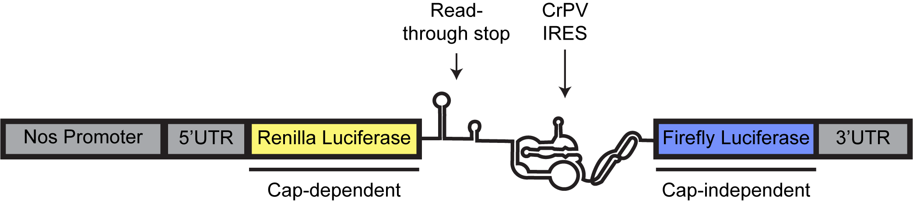

\setstretch{1.0}

(ref:Screen-1-short) **Schematic of dual luciferase reporter used for screen.**

(ref:Screen-1-long) \setlength\parindent{0pt}The dual luciferase reporter consists of a Nos promoter and 5'UTR controlling translation initaiation of *Renilla* luciferase followed by a read-though stop consisting of hairpins and the CrPV-IGR IRES which controls initiation of Firefly luciferase.

(ref:Screen-2-short) **Screen of post-translational modification enzymes.**

(ref:Screen-2-long) \setlength\parindent{0pt}Boxplot of relative IRES translation normalized to control ovaries resulting from knockdown of indicated target proteins. Boxes in green represent significant changes in relative IRES-mediated translation compared to control.

# Screen of post-translational modifying enzymes for their effects on translation

Elliot Martin, Siu Wah Wong-Deyrup, Gaby Fuchs, and Prashanth Rangan

\setstretch{2.0}
\setlength\parindent{24pt}

## Abstract

The ribosome has been demonstrated to play an active role in regulating
translation. We hypothesized that post-translational modifications on
ribosomal proteins might modulate the activity of the ribosome.
Therefore, we attempted to screen for enzymes known to deposit
post-translational modifications with the goal of identifying genes that
play a role in regulating translation using a dual-luciferase assay
which monitors the relative amount of Internal Ribosome Entry Site
(IRES) translation compared to cap-based translation. We identified
several genes that had a significant effect on the translation of the
dual luciferase reporter, however, these affects were modest. We also
found that ovaries enriched for stem cells and stem cell daughters had
significantly higher relative IRES translation, however, we did not
observe the expected result when we knocked down RpS25, which is known
to be required for efficient IRES translation. Due to these limitations,
we did not pursue these findings further.

## Introduction

In the past, ribosomes have been considered as passive players in the
process of translation. However, evidence has begun to accumulate that
ribosomes can play a regulatory role in translation
[@goscinskaEvolvingRoleRibosomes2020]. There are several mechanisms
through which ribosomes have been found to regulate translation. One
example of this is Rack1 which is a core ribosomal protein
[@gerbasiYeastAsc1pMammalian2004]. Despite the role of Rack1 as a
core ribosomal protein, it is dispensable for cell viability, but
required for efficient Internal Ribosome Entry Site (IRES) translation
[@coyleDirectLinkRACK12009;@lafontaine2020ribosomal;@majzoubRACK1ControlsIRESMediated2014]. Furthermore, Rack1 activity
can be regulated through post-translational phosphorylation which can be
exploited during viral infection to allow for translation initiation on
polyA-leader sequences [@jhaTranskingdomMimicryUnderlies2017].

Other mechanisms of translation control involving the ribosome have not
been conclusively demonstrated but show promise. For instance, under
stress conditions, ribosomal proteins have been shown to carry different
post-translational modifications than under basal conditions
[@jhaTranskingdomMimicryUnderlies2017;@mukhopadhyayDAPKZIPKL13aAxisConstitutes2008;@simsekEmergingRoleRibosome2017]. The modifications in some cases can
alter the propensity of the ribosome to translate certain mRNAs, which
could allow the cell to better adapt to varying conditions
[@jhaTranskingdomMimicryUnderlies2017].

There are two main modes of translation initiation, canonical cap-based
translation and cap-independent translation. Cap-based translation is a
complex many-stepped process in which the 43S ribosome pre-initiation
complex (43S PIC) is recruited to an mRNA through interacting with
cap-binding protein (eIF4E) as well as other components
[@jacksonMECHANISMEUKARYOTICTRANSLATION2010]. This initiates scanning
where the 43S PIC moves along the mRNA until a suitable start codon is
identified and translation begins once a 60S ribosomal subunit is
recruited [@jacksonMECHANISMEUKARYOTICTRANSLATION2010]. Translation
can also be initiated cap-independently
[@jacksonMECHANISMEUKARYOTICTRANSLATION2010]. Several mechanisms can
allow translation to occur without the presence of eIF4E, but of
interest to this work is IRES-based initiation
[@shatskyCapIndependentTranslationWhat2018]. IRESs are secondary
structures of RNA of which several classes have been described which are
classified based on the initiation factors they require as well as their
secondary structure [@mailliotViralInternalRibosomal2018]. IRESs
bypass at least the use of eIF4E and can bypass the use of any
initiation factors at all, requiring only the 40S and 60S ribosomal
subunits to perform initiation [@mailliotViralInternalRibosomal2018;@shatskyCapIndependentTranslationWhat2018]. In general, IRESs are used
at a higher rate under stress conditions such as those initiated by
viral infection, but also under other stress conditions
[@mailliotViralInternalRibosomal2018;@shatskyCapIndependentTranslationWhat2018]. However, how cellular
stress changes the usage of IRES translation vs cap-based translation is
not fully understood.

We performed a screen to attempt to identify enzymes that
post-translationally modify proteins and have the potential to alter the
translation landscape. To perform this screen, we used the *Drosophila*
  ovary as it has several advantages. First, *Drosophila* have thousands
of available RNAi lines that can be used to knock down genes of interest
[@delvallerodriguezPowerToolsGene2012]. Second, many of the genes we
chose to screen are histone modifying enzymes that may be required for
cell survival, by using the ovary as our tissue of interest, we were
able to deplete those genes in the germline without affecting the
viability of the flies. The last major advantage to working in the
*Drosophila* ovary in this case is that endogenous control elements have
been identified allowing for expression of a reporter specifically in
the germline [@rorthGal4DrosophilaFemale1998;@seranoElementTransformationVectors1994]. This in combination with
germline specific RNAi allowed us to assay for changes in translation
only in the germline tissue.

## Results and Conclusions

To assess the status of translation we adapted a dual luciferase assay
commonly used to monitor translation status. This reporter contains two
ORFs encoded in a single transcript which allowed us to assay for
changes in translation while eliminating confounding differences in
transcription. The reporter transcript was under the control of a Nos
promoter, which is only expressed in the germline. The reporter had a
Nos 5\'UTR and a K10 3\'UTR which have both been demonstrated to have a
neutral effect on translation [@gavisLocalizationNanosRNA1992;@gavisLocalizationNanosRNA1992;@seranoElementTransformationVectors1994]. The first ORF encodes
*Renilla* luciferse under the control of the Nos 5\'UTR and its
production monitors for cap-based translation, this ORF is followed by
hairpins to prevent ribosomal read-through. The second ORF encodes a
firefly luciferase under the control of the Cricket Paralysis Virus
intergenic (CrPV) IRES . These luciferases can be monitored sequentially
as they require different conditions in order to produce luminescence
and in this way can be used to monitor changes in the relative amount of
IRES to cap-based translation.


```{r Screen-fig-1, fig.align="center", include=TRUE, out.width="97%", fig.align="center", fig.cap="(ref:Screen-1-short)", fig.scap="(ref:Screen-1-short)", echo=FALSE}

```

\setstretch{1.0}

(ref:Screen-1-long)

\setstretch{2.0}
\setlength\parindent{24pt}

We performed a screen of 35 genes known to perform post-translational
modification to determine if any of them played a role in regulating
IRES vs cap-based translation. We also screened several control genes to
ensure our reporter system was working as intended. We knocked down
RpS25 which is known to be required for IRES, but not cap-based
translation, however, we did not find a statistically significant
difference between the knockdown and control ovaries
[@hertzRibosomalProteinS252013;@landryRPS25EssentialTranslation2009]. There are a several
explanations of this finding. First, knockdown of RpS25 had a severe
phenotype, which was unexpected as previous work indicated that RpS25 is
required for IRES, but not cap-based translation
[@landryRPS25EssentialTranslation2009]. Therefore, it could be that
developmental differences between the control and RpS25 RNAi masked any
change in relative IRES translation. Second, it is possible RpS25 is not
efficiently depleted or that the RNAi line used has off-target effects.
Because of this lack of a result from RpS25 RNAi, our positive control,
the remainder of our findings must be taken in context. Several genes
were found to have a significant affect on the amount of relative IRES
translation, including Not, HDAC3, Lsd1, nsl-1, and Set8.  

We additionally included two developmental controls to determine if a
phenotype which enriched for stem cells (UAS-*tkv*) or stem cell
daughters (*bam* RNAi) would alter the relative IRES translation .
Indeed, we found that the relative IRES translation was slight, but
significantly elevated. This could suggest that IRES translation occurs
more in the stem cells and stem cell daughters of the ovary.  

Lastly, we identified five genes that when knocked down resulted in
significantly lower relative IRES translation, including *Set8*,
*nsl-1*, *Lsd1*, *HDAC3*, and *Not*. However, the affect size observed
when these genes were knocked down was modest, with Set8 having the most
dramatic affect with a 23.6% reduction in the relative amount of IRES
translation. However, it should also be noted that as is widely
accepted, no multiple test-correction was performed as for screens
multiple-test correction leads to a high degree of type I error and
screens typically are followed by confirmatory studies
[@gausInterpretationStatisticalSignificance2015]. In this case the
results have not been followed-up for the aforementioned limitations
regarding RpS25 as well as how the subtle changes in relative IRES
translation were.


```{r Screen-fig-2, fig.align="center", include=TRUE, out.width="95%", fig.align="center", fig.cap="(ref:Screen-2-short)", fig.scap="(ref:Screen-2-short)", echo=FALSE}
knitr::include_graphics("./figure/Screen/IRES_screen.png")
```

\setstretch{1.0}

(ref:Screen-2-long)

\setstretch{2.0}

As one of the largest changes to relative IRES translation was in *bam*
RNAi, which increased relative IRES translation by 23%, it could indeed
be that IRES translation is regulated over the course of stem cell
differentiation. Future work should be aimed at this aspect of these
findings. A spatial version of this reporter could be made using
fluorescent reporters to assay the relative IRES translation over stem
cell differentiation in the ovary.

## Methods

### Flylines

*nosGAL4* (Bloomington stock 7303)

Generated by this work: *nosGAL4*; *dLuciferase*

Protein targets screened and corresponding RNAi line number used:

  Protein Target   Line Number
  ---------------- -------------
  Gpp              v110264
  D12              v29954
  Art8             v100228
  Su(z)12          33402
  Sgf29            36637
  Atac2            32890
  CG2051           34730
  chm              32484
  Tip60            28563
  Set1             33704
  chm              32484
  Atac2            53918
  Lsd1             V16235
  Ada3 (dik)       28905
  Caf1             31714
  CG10289          35597
  Spt7 (comr)      42552
  E(z)             36068
  Enok             29518
  faf              35728
  Gcn5             33981
  Hdac3            31633
  Jarid2           32891
  Ubp8 (not)       28725
  nsl1 (wah)       32561
  Polybromo        32840
  Set8             35322
  Su(var)205       33400
  Sxc              50909
  Trr              29563
  Wda              31125
  Rps25            V101342
  LRRK             32457
  S6K              41895
  S6KII            41895
  TKV              36537

### Cloning

A gBlock corresponding to a codon optimized version of *Renilla* and
firefly luciferase as well as the readthrough block and CrPV IGR IRES
were purchased from IDT. This gBlock was cloned using Gibson cloning
according to manufacturer\'s instructions (\#E2611S) into pCasper2
containing a Nos promoter and K10 3\'UTR. Colonies were picked, cultured,
and plasmids purified and sequenced by Eton Bioscience Inc. to conform
the correct sequence had been cloned. A midi-prep scale of the plasmid
was prepared using standard methods and plasmids were sent to BestGene
Inc. for microinjection.

### Dual luciferase assay

Ovaries were dissected on 1X PBS in microcentrifuge tubes. Excess PBS
was aspirated and ovaries were stored at -20°C. Ovaries were lysed in 25
µl of passive lysis buffer (Promega) using a plastic pestle. 20 µl of
lysate was added to a white 96 well plate and luminance was measured
using a Glomax 20/20 luminometer (Promega) using the dual luciferase
assay reagent (Promega \#E1910). At least three biological replicates
for Firefly/*Renilla* luminescence values of each RNAi line were
generated.
